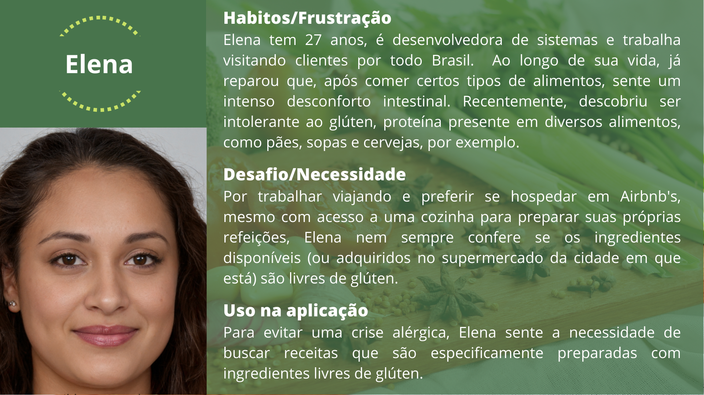
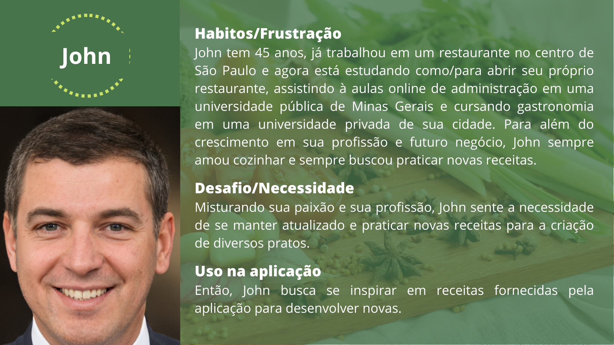
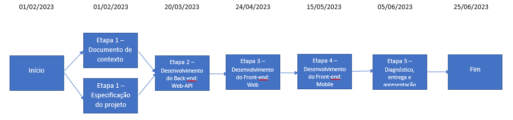
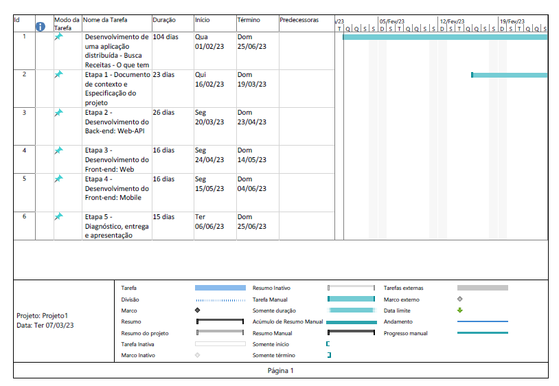
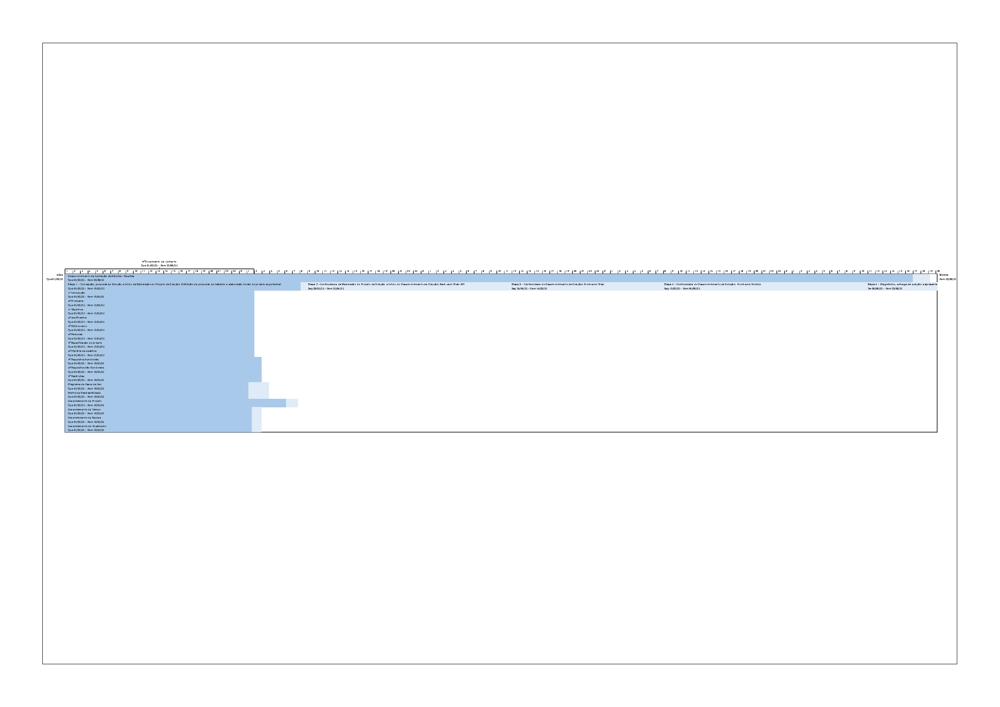
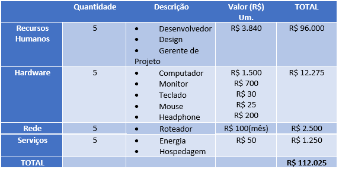

# Especificações do Projeto

Nesta seção, apresentamos o diagrama de personas, histórias de usuários, requisitos funcionais e não funcionais, além das restrições identificadas para o desenvolvimento deste projeto.  

## Personas

## Histórias de Usuários

Com base na análise das personas forma identificadas as seguintes histórias de usuários:

|EU COMO... `PERSONA`| QUERO/PRECISO ... `FUNCIONALIDADE` |PARA ... `MOTIVO/VALOR`                 |
|--------------------|------------------------------------|----------------------------------------|
|Eu, Elena, Usuário do sistema  | Buscar por receitas que não utilizem alimentos com glúten        | Para me alimentar bem enquanto viajo a trabalho |
|Eu, Isabella, Usuário do sistema  | Buscar por receitas que utilizem os alimentos que já tenho em casa    | Para ganhar tempo para realizar minhas demais tarefas |
|Eu, John, Usuário do sistema  | Buscar novas receitas    | Para manter-me atualizado no mundo da gastronomia |
|Eu, John, Usuário do sistema  | Salvar as receitas que gostei | Para manter um histórico e acessar facilmente quando necessário |

## Modelagem do Processo de Negócio 

### Análise da Situação Atual

Ainda que estamos cercados de tanta tecnologia, nos deparamos com algumas pessoas que tem aquele livro ou caderno de receitas em seu armário de cozinha.
A cada dia que se passa o mundo de receitas vem se tornando grandioso, e manter o armazenamento em cadernos escritos torna-se inviável. Também existe a possibilidade de salvar digitalmente em diversos aplicativos e sites, mas buscar essas receitas posteriormente pode não ser um processo tão eficiente.

### Processo – Buscar e Salvar Receitas

### Análise do Ambiente Externo

Entretanto, é necessário considerar alguns dificultores que podem inviabilizar a elaboração da proposta seguinte. A restrição no prazo de planejamento e elaboração da aplicação móvel, bem como curto período de teste dele, pode ocasionar imprecisão na aplicabilidade e utilização do software. O mercado de aplicativos é dinâmico e muito amplo, sendo assim, é importante atentar-se para as plataformas existentes que oferecem propostas similares. É interessante desenvolver estratégias direcionadas para a implementação de um aplicativo com diferenciais competitivos destacando o "O que tem pra hoje?" no setor da culinária.

### Descrição Geral da Proposta

Considerando o atual cenário em que estamos vivendo, muitas pessoas tem acesso a um computador, tablet ou smartphone.
Nossa proposta é aproveitar o acesso a tecnologia e desenvolver uma aplicação móvel em que os usuários tenham na palma das suas mãos um livro de receitas em forma de aplicativo. Nele será possível armazenar e buscar receitas de forma mais eficiênte ao utilizar filtros, por exemplo, de ingredientes e tempo de preparo, facilitando assim a rotina dos usuários.

### Processo – Buscar e Salvar Receitas

## Indicadores de Desempenho

Seguem abaixo a relação dos indicadores de desempenho desenvolvidos para o projeto:

| Nº | Indicador | Objetivo | Descrição | Cálculo | Fonte de Dados | Perspectiva | Meta | Periodicidade |
|----|-----------|----------|-----------|---------|----------------|-------------|------|---------------|
|	1	|	Taxa de buscas realizadas	|	Avaliar o sucesso de busca de receitas da plataforma|	Número de pesquisas efetuadas	|	Medir % de receitas pesquisadas durante um mês	|	Play Store e Apple Store	|	Qualidade do produto	|	500 pesquisas por mês |	Trimestral	|
|	2	|	Taxa de download do aplicativo	|	Verificar a quantidade de downloads do aplicativo	|	Avaliar a quantidade de pessoas que baixaram e utilizaram o app no último mês	|	Número de downloads por mês	|	Play Store e Apple Store	|	Difusão do produto e da marca	|	70 usuários por mês	|	Mensal	|
|	3	|	Número de acessos ao site	|	Verificar a quantidade de pessoas que acessam a versão Web	|	Avaliar a quantidade de acessos únicos ao site	|	Acessos únicos por mês	|	Google Analytics	|	Difusão do produto e da marca	|	70 usuários por mês	|	Mensal	|
|	4	|	Percentual de reclamações mobile	|	Verificar o índice de reclamações recebidas em relação ao app e respondê- las	|	Razão entre o número de reclamações e a quantidade de downloads	|	Verificar as reclamações recebidas	|	Play Store e Apple Store	|	Qualidade do produto	|	Nenhuma reclamação	|	Mensal	|
|	5	|	Percentual de reclamações web	|	Verificar o índice de reclamações recebidas em relação à plataforma Web e respondê-las	|	Razão entre o número de reclamações e a quantidade de acessos únicos	|	Verificar as reclamações recebidas	|	Formulário de Contato	|	Qualidade do produto	|	Nenhuma reclamação	|	Mensal	|
|	6	|	Taxa de resolução de problemas	|	Resolver as reclamações feitas pelos usuários	|	Verificar as reclamações feitas pelos usuários, identificar possíveis erros no sistema e resolvê-los	|	Indice de avaliação de resolução de problemas	|	Play Store, Apple Store, Formulário de contato	|	Qualidade do produto	|	100%	|	Mensal	|
|	7	|	Período de inatividade		Verificar o tempo de inatividade dos usuários em relação ao app	|	Medir o intervalo de tempo médio que os usuários ficam sem utilizar o app	|	Média das diferenças entre as datas de acesso	|	Melhoria continua	|	Banco de Dados do aplicativo	|	Tempo mínimo entre as pesquisas	|	Semestral	| 

### Requisitos Funcionais

|ID    | Descrição do Requisito  | Prioridade |
|------|-----------------------------------------|----|
| RF-001 | O sistema deverá permitir a criação de um perfil de usuário.  | ALTA | 
| RF-002 | O sistema deverá permitir a alteração e a exclusão dos dados de usuários.   | ALTA | 
| RF-003 | O sistema deverá permitir armazenar as receitas. | ALTA |
| RF-004 | O sistema deverá permitir a edição e a exclusão das receitas.    | MÉDIA |
| RF-005 | O sistema deverá permitir a busca de receitas com a opção de filtrar sua pesquisa. | ALTA |
| RF-006 | o sistema deverá permitir a opção de salvar a receita escolhida.  | BAIXA |
### Requisitos não Funcionais

|ID     | Descrição do Requisito  |Prioridade |
|-------|-------------------------|----|
| RNF-001 | A aplicação deve ser compatível com sistemas Android e iOS. | ALTA | 
| RNF-002 | A aplicação deve ser compatível com os principais navegadores Web. | ALTA |
| RNF-003 | O projeto deverá ser implementado com um banco de dados NoSQL. |  MÉDIA |
| RNF-004 | O sistema deve processar requisições do usuário em no máximo 11 segundos. |  BAIXA |

## Restrições

O projeto está restrito pelos itens apresentados na tabela a seguir.

|ID| Restrição                                             |
|--|-------------------------------------------------------|
|01| O projeto deverá ser entregue até 25/06/2023. |
|02| Proibida a terceirização de desenvolvimento do sistema em sua totalidade ou de módulos isolados.        |

## Restrições

O projeto está restrito pelos itens apresentados na tabela a seguir.

|ID| Restrição                                             |
|--|-------------------------------------------------------|
|01| O projeto deverá ser entregue até o final do semestre |
|02| Não pode ser desenvolvido um módulo de backend        |

Enumere as restrições à sua solução. Lembre-se de que as restrições geralmente limitam a solução candidata.

## Diagrama de Casos de Uso

O diagrama abaixo representa a usabilidade da aplicação pelo usuário. Inicialmente é feito o acesso da aplicação onde o usuário deverá se cadastrar no site, em seguida ele tem as opções de buscar receitas com as características desejadas ou incluir suas próprias receitas para ficarem armazenadas.

# Matriz de Rastreabilidade

Ao longo do projeto, os requisitos podem mudar e o impacto desta mudança deve ser analisado e os riscos avaliados. "Para que a análise de impacto de uma mudança possa ser realizada de forma adequada, é necessário garantir que as ligações entre os requisitos ou entre os requisitos e outros elementos do sistema sejam conhecidas e possam ser utilizadas como base para essa análise." (REINEHR, 2020).

A tabela que se segue apresenta os requisitos funcionais e não funcionais que detalham o escopo do projeto. Para determinar a prioridade de requisitos, aplicamos uma técnica de priorização de requisitos e detalhamos, em sequência, como a técnica foi aplicada.

A técnica MoSCoW foi aplicada para priorização dos requsitos:

- Must Have (Tenho que fazer)
- Should Have (Devo fazer)
- Could Have (Poderia fazer)
- Won’t Have (Não vou fazer)

Nesse sentido a ordem de importância das tarefas vai seguindo uma ordem decrescente, em que "Must Have" são as tarefas mais relevantes e as "Won’t Have" são tarefas que podem ficar para depois.

| Importância | Cod. EAP |                     Nome                     |      Tipo     |                      Critérios de Aceitação                      |                                                     Descrição                                                     |
|:-----------:|:--------:|:--------------------------------------------:|:-------------:|:----------------------------------------------------------------:|:-----------------------------------------------------------------------------------------------------------------:|
| Must have   | RF-001   | Criação de Perfil                            | Funcional     | Criação de usuário sendo feita com sucesso                       | O sistema deverá permitir a criação de um perfil de usuário associado ao e-mail do usuário                        |
| Must have   | RF-002   | Exclusão e alteração dos Dados               | Funcional     | Exclusão e alteração de dados do usuário sendo feita com sucesso | O sistema deverá permitir a alteração e a exclusão dos dados e qualquer informação inserida pelos usuários.       |
| Must have   | RF-003   | Inclusão de receitas                         | Funcional     | Operações CRUD                                                   | O sistema deverá permitir a inserção de novas receitas.                                                           |
| Should have | RF-004   |  Edição e exclusão de receitas               | Funcional     | Operações CRUD                                                   | O sistema deverá permitir a alteração e a exclusão de receitas.                                                   |
| Must have   | RF-005   | Buscar Receitas                              | Funcional     | Buscar receitas utilizando filtros                               | O sistema deverá permitir a busca de receitas utilizando filtros.                                                 |
| Could have  | RF-005   | Salvar receitas escolhidas.                  | Funcional     | Salvar receitas encontradas durante as buscas                    | O sistema deverá permitir que o usuário salve as receitas que gostou para acessar com facilidade quando precisar. |
| Must have   | RNF-001  | Responsividade do Sistema em ambiente móveis | Não-Funcional | Responsividade do Sistema em ambiente móveis com sucesso         | O sistema deve ser responsivo para rodar em diversos dispositivos móveis.                                         |
| Must have   | RNF-002  | Implementação de Framework                   | Não-Funcional | Implementação do React Native feita com sucesso                  | O sistema deve ser implementado utilizando React Native.                                                          |
| Should have | RNF-003  | Uso de Banco do MySQL                        | Não-Funcional | Implementação do banco de dados em MySQL                         | A persistência dos dados será feita no banco MySQL.                                                               |
| Could have  | RNF-004  | Tempo de Requisição                          | Não-Funcional | Tempo de Requisição deve atender á descrição                     | O sistema deve processar requisições do usuário em no máximo 11 segundos.                                         |

# Gerenciamento de Projeto

De acordo com Vargas (2018), "[p]rojeto é um empreendimento não repetitivo, caracterizado por uma sequência clara e lógica de eventos, com início, meio e fim, que se destina a atingir um objetivo claro e definido, sendo conduzido por pessoas dentro de parâmetros predefinidos de tempo, custo, recursos envolvidos e qualidade." (VARGAS, 2018). Com essa definição em mente, desenvolvemos a documentação e o aplicativo AutoApp, tomando como base, também, os pressupostos sumarizados no PMBoK.

De acordo com a sexta edição do PMBoK, as dez áreas que constituem os pilares para gerenciar projetos, e que caracterizam a multidisciplinaridade envolvida, são: Integração, Escopo, Cronograma (Tempo), Custos, Qualidade, Recursos, Comunicações, Riscos, Aquisições, Partes Interessadas. Para desenvolver projetos, um profissional deve se preocupar em gerenciar todas essas dez áreas. Elas se complementam e relacionam-se de tal forma que não se deve apenas examinar uma área de forma estanque. É preciso considerar, por exemplo, que as áreas de Escopo, Cronograma e Custos estão muito relacionadas. Assim, se eu amplio o escopo de um projeto eu posso afetar seu cronograma e seus custos.

Todo projeto, antes de iniciado, deve ser avaliado sob uma perspectiva financeira. Há algumas técnicas que podem ser utilizadas para fornecer tal perspectiva: valor presente líquido, taxa interna de retorno, análise de custo-benefício, payback ou cost of delay. Além disso, ter a visão do produto é de extrema importância para o início e o fim do projeto.

## Divisão de Papéis

A equipe AutoApp utiliza métodos ágeis como metodologia de trabalho de acompanhamento do projeto. O método Scrum foi definido como base do processo de desenvolvimento. A equipe está organizada da seguinte maneira:

-	Product Owner (P.O.): Felipe Augusto Lara Soares;
-	Scrum Master: Vania Maria Tiburzio Rezende;
-	Equipe de Desenvolvimento: Cristiano Garcia, Michelle Leal Rodrigues, Pedro Daniel Jardim, Renata Diniz Guimarães de Oliveira e Vania Maria Tiburzio Rezende;
-	Equipe de Design: Michelle Leal Rodrigues, Renata Diniz Guimarães de Oliveira e Vania Maria Tiburzio Rezende.

A equipe trabalhará com divisões de tarefas e com encontros semanais após reunião com o P.O. para planejar e tirar dúvidas a respeito das tarefas delegadas.
Na primeira reunião de cada etapa, as tarefas serão organizadas e distribuídas.

Na segunda-feira que precede a entrega da etapa, a equipe irá se se reunir para revisar e alinhar se o que foi solicitado está pronto para ser entregue.
A Scrum Master acompanhará estas sprints (tarefas) semanalamente.

O projeto seguirá o seguinte fluxo de metodologia:

Utilizando essa metodologia, prevê-se ter uma maior produtividade, melhoria na comunicação, maior qualidade, integração entre os integrantes, respostas a imprevistos.

## Gerenciamento de Tempo

Segundo Vargas (2018), o gerenciamento do cronograma tem como principal objetivo garantir que o projeto seja concluído dentro do prazo determinado.

Com diagramas bem organizados, que permitem gerenciar o tempo nos projetos, o gerente de projetos agenda e coordena tarefas dentro de um projeto para estimar o tempo necessário de conclusão.

Para construir um bom diagrama, deve-se partir de um conjunto de atividades definidas, sequenciando-as de acordo com as dependências conhecidas entre si, estimando as durações das atividades individualmente e desenvolvendo a estrutura do projeto, em termos das tarefas e suas interações. É preciso, ademais, definir uma abordagem de ciclo de vida mais adequada ao projeto em questão.

O diagrama de rede pode ser entendido como um gráfico que mostra as tarefas que precisam ser realizadas para a finalização de um projeto. Além de mostrar as relações contínuas de atividades, mostra como fazer as atividades e o cronograma determina quando fazer as tarefas do projeto.

A seguir, encontra-se o diagrama de redes do projeto 

O gráfico de Gantt, ou diagrama de Gantt, também é uma ferramenta visual utilizada para controlar e gerenciar o cronograma de atividades de um projeto. Com ele, é possível listar tudo que precisa ser feito para colocar o projeto em prática, dividir em atividades e estimar o tempo necessário para executá-las. A seguir, encontra-se o diagrama de Gantt do projeto **O que tem pra hoje?**, utilizado como ferramenta de gerenciamento do cronograma do projeto.

## Gerenciamento de Equipe

O gerenciamento adequado de tarefas contribuirá para que o projeto alcance altos níveis de produtividade. Por isso, é fundamental que ocorra a gestão de tarefas e de pessoas, de modo que os times envolvidos no projeto possam ser facilmente gerenciados.

A Gestão do Código Fonte e a Divisão de Papéis da equipe, bem como o ambiente utilizado para o gerenciamento de recursos, encontram-se detalhados no tópico de Metodologia.

A seguir, é descrito o planejamento que auxiliará e direcionará a gestão de recursos durante o projeto.

Planejar o gerenciamento de recursos

Planejar como será feita a gestão de recursos do projeto;
Consultar opinião especializada sobre esse tipo de projeto;
Obter documentações necessárias para o desenvolvimento do projeto;
Atribuir funções às pessoas da equipe;
Planejar o cronograma de trabalho.
Estimar os recursos das atividades

Analisar quais os recursos necessários para realização das atividades e quantificar;
Recursos humanos: desenvolvedores e gestores do projeto;
Recursos materiais: seis computadores com editores de código fonte instalados;
Acesso ao Figma;
Aulas PUC-Minas.
Adquirir recursos

Acesso às aulas da PUC Minas via matrícula de alunos;
Acesso ao figma por contas vinculadas (gmail);
Alunos e componentes do projeto atuam como desenvolvedores e gestores;
Utilização de computadores dos alunos do projeto.
Desenvolver a equipe

Treinamento da equipe em React Native;
Treinamento da equipe em gerenciamento de projetos;
Treinamento na utilização do Figma;
Soft skills.
Gerenciar a equipe

Atualizar a documentação;
Atualizar outros fatores que podem influenciar no desenvolvimento do projeto;
Planejamento por entregas;
Atualização do plano de gerenciamento do projeto.
Controlar os recursos

Informações sobre o desempenho e andamento do trabalho;
Atualizações sobre o plano de gerenciamento de recursos.

Segue timeline

## Gestão de Orçamento

O processo de determinar o orçamento do projeto é uma tarefa que depende, além dos produtos (saídas) dos processos anteriores do gerenciamento de custos, também de produtos oferecidos por outros processos de gerenciamento, como o escopo e o tempo. Afinal, “[é] o processo que agrega os custos estimados de atividades individuais ou pacotes de trabalho para estabelecer uma linha de base dos custos autorizada.” (VARGAS, 2018).

Nesse contexto, segue abaixo o orçamento estimado para o desenvolvimento do projeto de implantação do **O que tem pra hoje?**

Memória de Cálculo
-	Recursos Humanos = 5 pessoas x R$ 60,00/Hora x 64 Horas (mês) = R$ 23.040,00 x 5meses = 96.000,00
-	Hardware = 5 Computadores, monitores, teclados, mouses e headphones x R$ 2455,00 = R$ 12.275,00
-	Rede = 5 internet banda larga x R$ 100,00/Mês x 5 Meses = R$ 2.500,00
-	Serviços = 5 despesas (energia, hospedagem) x R$ 50,00/Mês x 5 Meses = R$ 1.250,00
