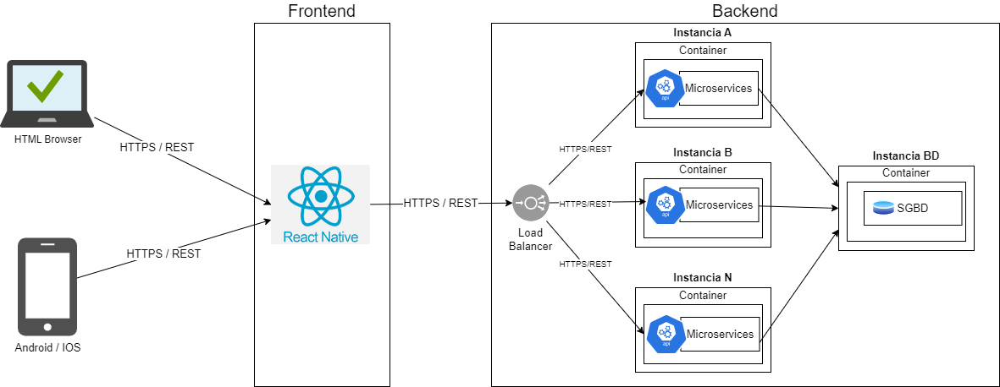
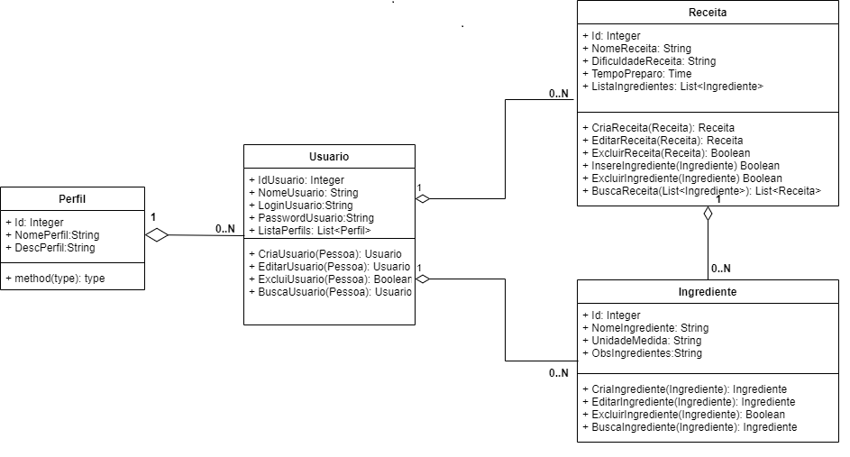
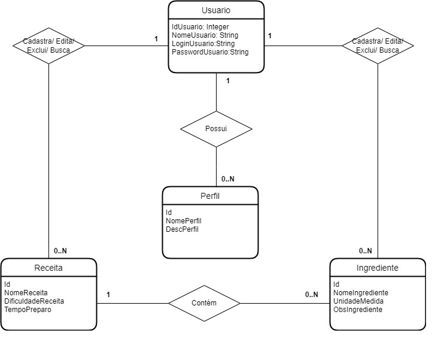
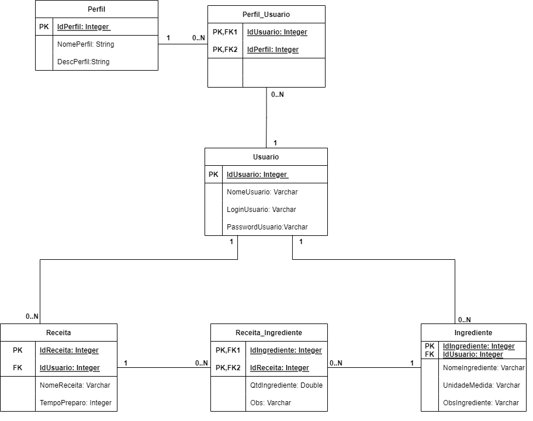
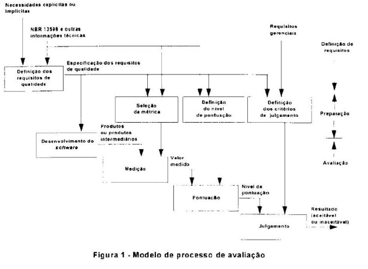

# Arquitetura da Solução

Definição de como o software é estruturado em termos dos componentes que fazem parte da solução e do ambiente de hospedagem da aplicação.

## Diagrama de Classes

O diagrama de classes ilustra graficamente como será a estrutura do software, e como cada uma das classes da sua estrutura estarão interligadas. Essas classes servem de modelo para materializar os objetos que executarão na memória.

## Modelo ER

O Modelo ER representa através de um diagrama como as entidades (coisas, objetos) se relacionam entre si na aplicação interativa.

## Esquema Relacional

O Esquema Relacional corresponde à representação dos dados em tabelas juntamente com as restrições de integridade e chave primária.
 

## Modelo Físico

[Link contendo os scripts de criação das tabelas do bamco de dados](https://github.com/ICEI-PUC-Minas-PMV-ADS/pmv-ads-2023-1-e4-proj-infra-t1-time4-buscareceitas/tree/main/src).

## Tecnologias Utilizadas

Descreva aqui qual(is) tecnologias você vai usar para resolver o seu problema, ou seja, implementar a sua solução. Liste todas as tecnologias envolvidas, linguagens a serem utilizadas, serviços web, frameworks, bibliotecas, IDEs de desenvolvimento, e ferramentas.

Apresente também uma figura explicando como as tecnologias estão relacionadas ou como uma interação do usuário com o sistema vai ser conduzida, por onde ela passa até retornar uma resposta ao usuário.

## Hospedagem

Explique como a hospedagem e o lançamento da plataforma foi feita.

> **Links Úteis**:
>
> - [Website com GitHub Pages](https://pages.github.com/)
> - [Programação colaborativa com Repl.it](https://repl.it/)
> - [Getting Started with Heroku](https://devcenter.heroku.com/start)
> - [Publicando Seu Site No Heroku](http://pythonclub.com.br/publicando-seu-hello-world-no-heroku.html)

## Qualidade de Software

Conceituar qualidade de fato é uma tarefa complexa, mas ela pode ser vista como um método gerencial que por meio de procedimentos disseminados por toda a organização, busca garantir um produto final que satisfaça às expectativas dos stakeholders.

No contexto de desenvolvimento de software, qualidade pode ser entendida como um conjunto de características a serem satisfeitas, de modo que o produto de software atenda às necessidades de seus usuários. Entretanto, tal nível de satisfação nem sempre é alcançado de forma espontânea, devendo ser continuamente construído. Assim, a qualidade do produto depende fortemente do seu respectivo processo de desenvolvimento.

Com isso, as normas de qualidade ajudam desenvolvedores a criarem softwares com as características ideais de qualidade. Segundo Zanin et al. (2018), as normas de qualidade ajudam os desenvolvedores a criarem softwares com as características ideais de qualidade.

A norma internacional ISO/IEC 25010, que é uma atualização da ISO/IEC 9126, define oito características e 30 subcaracterísticas de qualidade para produtos de software. 

Com base nessas características e subcaracterísticas segue abaixo as que foram escolhidas para nortear o desenvolvimento projeto de aplicação distribuída "O que tem pra hoje?", bem como a justificativa e métricas que permitirão à equipe avaliar os objetos de interesse. 

**Segurança**:

- Confidencialidade: *A aplicação garante a confidencialidade dos dados? Sim e Não.*

- Integridade: *A aplicação garante a integridade dos dados? Sim e Não.*

**Usabilidade**:

- Apreensibilidade: *É fácil aprender a utilizar a aplicação? Sim e Não.*

- Operacionalidade: *É fácil de operar e controlar a funcionalidades da aplicação? Sim e Não.*

- Estética da interface: *A aplicação possui interface atual? Sim e Não.*

- Inteligibilidade: *A interface é de fácil entendimento? Sim e Não*

**Portabilidade** :

- Adaptabilidade: *O sistema esta adaptado a Android e IOS? Sim e Não.*

- Facilidade de para ser instalado: *É fácil instalar a aplicação em outros ambientes? Sim e Não.*

- Conformidade: *O sistema apresenta aderência a padrões de portabilidade? Sim e Não*

**Confiabilidade** :

- Maturidade: *Com que frequência a aplicação apresenta falhas? Sempre, As vezes e Nunca.*

- Recuperabilidade: *A aplicação é capaz de recuperar dados após uma falha? Sim e Não.*

- Tolerância a falhas: *A aplicação reage bem às falhas que aparecem? Sim e Não*

**Eficiência** :

- Tempo: *Mínimo tempo de resposta? Sim e Não. Máxima velocidade de execução? Sim e Não*

- Recursos utilizados: *Mínimo uso de recursos para o mesmo resultado? Sim e Não*

**Manutenibilidade** :

- Modificabilidade: *Há facilidade em modificar o código? Sim e Não*

- Testabilidade: *Há facilidade de testar a aplicação? Sim e Não*

A qualidade no ciclo de vida do software  consiste em todas as etapas que o produto passará, desde os primeiros passos, na elicitação de requisitos, até o fim do uso do produto, seguindo o seguinte ciclo: Implementa requisitos, valida, verifica necessidades, implementa necessidade, valida e verifica novamente. Segundo o modelo da ABNT 13596:

> **Links Úteis**:
>
> - [ISO/IEC 25010:2011 - Systems and software engineering — Systems and software Quality Requirements and Evaluation (SQuaRE) — System and software quality models](https://www.iso.org/standard/35733.html/)
> - [Análise sobre a ISO 9126 – NBR 13596](https://www.tiespecialistas.com.br/analise-sobre-iso-9126-nbr-13596/)
> - [Qualidade de Software - Engenharia de Software 29](https://www.devmedia.com.br/qualidade-de-software-engenharia-de-software-29/18209/)
